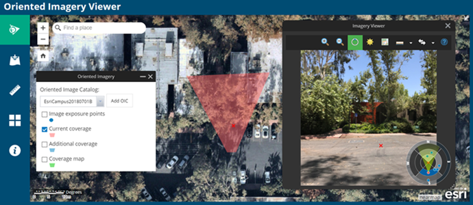

# Oriented Imagery

This repo contains developer resources for Oriented Imagery, including 2D and 3D Web AppBuilder widgets, the Experience Builder widget, a description of the Oriented Imagery API, and a schema for oriented imagery catalogs (OICs). Learn more about [Oriented Imagery](https://doc.arcgis.com/en/imagery/workflows/resources/managing-and-visualizing-oriented-imagery.htm) on the Imagery Workflows site.

Use the Oriented Imagery widgets for Web AppBuilder for ArcGIS and Experience Builder to build web apps to explore oriented imagery (imagery not pointing straight down at the ground) from aerial, drone, or terrestrial sensors. App users select an oriented imagery catalog, click a location of interest on the map, then explore any available oblique, street-view, or inspection images that depict the area of interest using the inset viewer. As you pan and zoom in the oriented image, see the camera’s field of view dynamically updated on the map. Check out examples of a [2D app](https://oi1.img.arcgis.com/app/index.html) and a [3D app](https://oi1.img.arcgis.com/app3D/index.html) built with the widgets.

Also in this repo, find a description of the [Oriented Imagery API](OrientedImagery_API.pdf), which can be used to build custom oriented imagery applications. 

This repo also contains a [description of the oriented imagery catalog (OIC) schema](OrientedImageryCatalog_Schema.pdf) for use in developing your own applications. OIC is the data structure used to manage oriented imagery in ArcGIS. The OIC is defined as a JSON that references a point-based feature service that defines the camera location, orientation, and image metadata. 

To view OICs in ArcGIS Pro, download the [Oriented Imagery add-in for ArcGIS Pro](https://esriurl.com/OrientedImageryAddIn). To create and manage your own OICs, download the Oriented Imagery Management Tools from [ArcGIS Online](https://www.arcgis.com/home/item.html?id=36ee0bbedca64a5a8b68d7c69ab51728).

## What's new in Oriented Imagery developer resources

### Version 2.7 (release July 2021)

* What’s new in Oriented Imagery API:
   - Use of item popup in image attribute viewer
   - Tiff / COGG file support.
   - Use of feature service item URL in OIC.
   - Support to access OICs from IWA enabled portals.
   - 360 degree video bug fix.
   - Other bug fixes.

* What’s new in Oriented Imagery 3D widget for Web AppBuilder For ArcGIS:
   - Updated Oriented Imagery API to v2.7
   - Several general fixes and performance and stability improvements.
   
* What’s new in Oriented Imagery widget for Experience Builder:
   - Updated Oriented Imagery API to v2.7
   - Bug fixes

### Version 2.6 (release April 2021)

* What’s new in Oriented Imagery API:
   - Added Time selector to filter images based on days, weeks, months, and years.
   - Added support for 360 video
   - Added superimpose view to superimpose imagery into maps on top of 3D Data layers and vector layers
   - Added image attributes tool to display attributes for the current image
   - Added support to adjust the size of navigation tool
   - Updated best image computation based on imagery type
   - Updated UI/UX of the viewer
   - Several general fixes and performance and stability improvements.
* What’s new in Oriented Imagery 3D widget for Web AppBuilder For ArcGIS:
   - Updated UI/UX of the widget
   - Updated Oriented Imagery API to v2.6
   - Several general fixes and performance and stability improvements.

### Version 2.4 (release July 2020)

* Web AppBuilder widgets using the ArcGIS API for JavaScript 4.x have been released. The 3.x versions are moved to mature support.
* The Oriented Imagery API now supports: 
    - Two different navigation tools: basic and advance.
	- You can now set the distance of features during editing for increased accuracy.
	- Point features now support labeling mode, where you can draw rectangles around objects on the image for point feature layers. 
* The sample web apps and 3D widget have the following enhancements:
	- Users can now add OICs from their ArcGIS Enterprise Portal account.
	- OAuth support for logging in.

### Version 2.3 (release May 2020)

* Web AppBuilder widgets using the ArcGIS API for JavaScript 4.x have been released. The 3.x versions are moved to mature support.
* The Oriented Imagery API now supports attaching bubble and panoramic imagery to a feature service.
* The sample web apps have two enhancements:
	- App users can now add OICs from My Organization's Groups in ArcGIS Online. 
	- The Image Exposure points layer is grayed out if no exposure points are found.

### Version 2.2 (release March 2020)

* When digitizing in the web app, the user will now be prompted to add ImgUrn and ImgGeom fields to the feature service if they're not already there.
* The Oriented Imagery API now includes the following:
	- Support for using a feature service with attachments as your data source.
	- Option to digitize features with measurement ON.
	- New navigation tool.
	- If the OIC includes an acquisition date, the date is displayed in the viewer.
	- Bug fixes for auto switch mode and for when near distance = 0.

### Version 2.1 (release January 2020)

* [Custom Oriented Imagery Types](https://github.com/Esri/oriented-imagery/tree/master/CustomTypes) are now available for download.
* Fieldnames are now case insensitive in the Oriented Imagery API.
* In the API, measurement tools automatically turn on and off based on accuracy and depth info.

## Working with the widgets

### Widget features

* Build custom Oriented Imagery apps with no programming required
* Support for standard frame, panoramic, or omnidirectional cameras (among others) 
* A built-in viewer for non-nadir imagery, or the option to integrate a custom imagery viewer
* Spatial navigation tools designed to work with non-nadir imagery
* Querying based on current view and filters (including time)
* Image enhancement options
* Linear and height measurement tools – where suitable ancillary data available
* Synchronized display of view extent
* Option to display extents and images similar to your current selection
* API to help 3rd party developers

### Instructions for using the Web AppBuilder 3D widget

1. Download and unzip the Oriented Imagery repo ZIP file
2. Download and install [Web AppBuilder for ArcGIS (Developer Edition)](https://developers.arcgis.com/web-appbuilder/guide/getstarted.htm)
3. Follow the instructions for [custom widget deployment](https://developers.arcgis.com/web-appbuilder/guide/deploy-custom-widget-and-theme.htm) 

### Instructions for using the Experience Builder widget

1. Download and unzip the Oriented Imagery repo ZIP file
2. Download and install [ArcGIS Experience Builder (Developer Edition)](https://developers.arcgis.com/experience-builder/guide/)

### Requirements

* ArcGIS Online or ArcGIS Enterprise portal account
* Web AppBuilder for ArcGIS 2.15+ Developer Edition
* ArcGIS Experience Builder 1.3+ Developer Edition

### Resources

* [Web App Builder for ArcGIS (Developer Edition)](https://developers.arcgis.com/web-appbuilder/)
* [ArcGIS Experience Builder (Developer Edition)](https://developers.arcgis.com/experience-builder/)
* Examples of a [2D app](https://oi1.img.arcgis.com/app/index.html) and a [3D app](https://oi1.img.arcgis.com/app3D/index.html) built with Oriented Imagery widgets

## Issues

Find a bug or want to request a new feature?  Please let us know by submitting an issue.

## Contributing

Esri welcomes contributions from anyone and everyone. Please see our [guidelines for contributing](https://github.com/esri/contributing).

## Licensing
Copyright 2019 Esri

Licensed under the Apache License, Version 2.0 (the "License");
you may not use this file except in compliance with the License.
You may obtain a copy of the License at

   http://www.apache.org/licenses/LICENSE-2.0

Unless required by applicable law or agreed to in writing, software
distributed under the License is distributed on an "AS IS" BASIS,
WITHOUT WARRANTIES OR CONDITIONS OF ANY KIND, either express or implied.
See the License for the specific language governing permissions and
limitations under the License.

A copy of the license is available in the repository's [License](LICENSE?raw=true) file.

